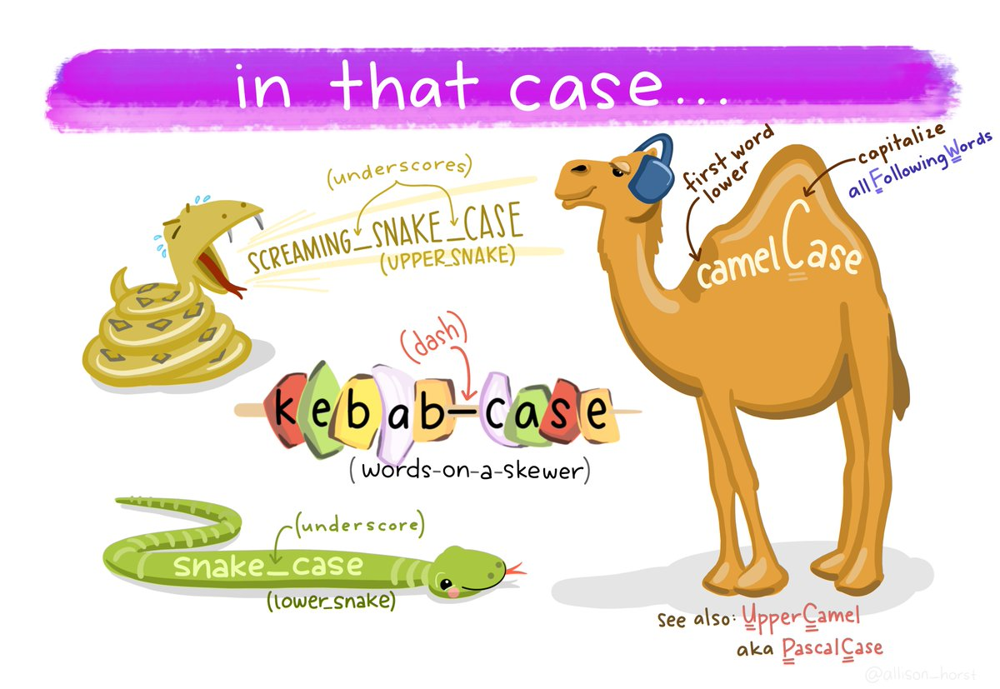
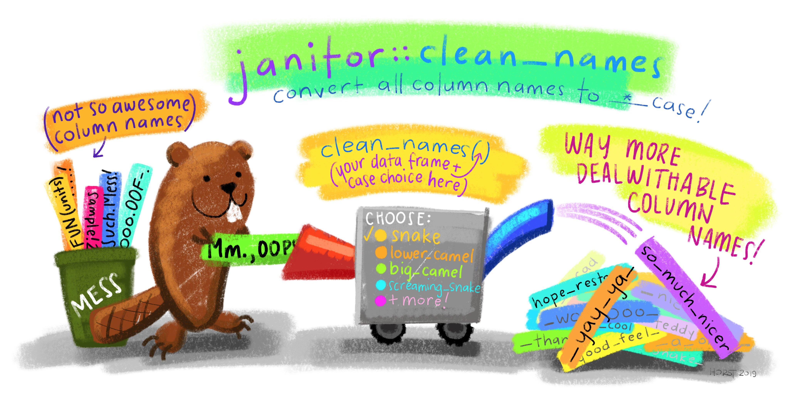
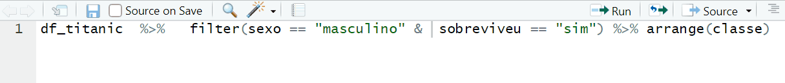

layout: true
  
<div class="my-footer"><span>


Source: <a href="https://es.r4ds.hadley.nz/funciones.html"> Funciones. R para Ciencia de Datos by Hadley Wickham and Garrett Grolemund. </a> 


</span></div> 
---
class:

```{r setup, include=FALSE}
options(htmltools.dir.version = FALSE)

knitr::opts_chunk$set(fig.align = "center", out.width = "100%",
                      message = FALSE,
                      warning = FALSE)
```


```{r include=FALSE}
library(tidyverse)
```


.pull-left[

- [R for Data Science](https://r4ds.had.co.nz/)

```{r echo=FALSE, out.width="70%"}
knitr::include_graphics("https://es.r4ds.hadley.nz/cover.png")
```

]

.pull-right[

- [R para Ciencia de Datos](https://es.r4ds.hadley.nz/)

```{r echo=FALSE, out.width="90%"}
knitr::include_graphics("https://es.r4ds.hadley.nz/hex_r4ds-es.png")
```
]

---
class:

# Introducción

- Las funciones permiten automatizar algunas tareas comunes de una forma más poderosa y general que copiar-y-pegar

- Consejos para:
    
    - Escribir funciones

    - Estilo de código

## Prerrequisitos

- R

- RStudio


```{r echo=FALSE, out.width="40%"}
knitr::include_graphics("img/rlogos/rstudio-r.jpg")
```


```{r eval=FALSE, include=FALSE}
# Pacote Tidyverse
# install.packages("tidyverse")
library(tidyverse)
```


---
class:

# Principio DRY - “Do not Repeat Yourself”

- “No repetirse a uno mismo”: Cuanta más repetición tengas en tu código, más lugares tendrás que recordar de actualizar cuando las cosas cambien, y es más probable que crees errores (bugs) a lo largo del tiempo.

---
class:

# Funciones

- Extraer el código repetido en una función es una buena idea, ya que previene que cometas errores.

- Otra ventaja de las funcioens es que si nuestros requerimientos cambian, solo necesitamos hacer modificaciones en un solo lugar. 

- Deberías considerar escribir una función cuando has copiado y pegado un bloque de código más de dos veces.

- Para escribir una función, lo primero que necesitas hacer es analizar el código. ¿Cuantos inputs tiene?

-  Es más fácil empezar con código que funciona y luego convertirlo en una función; es más difícil crear la función y luego tratar que funcione.


- Una función devuelve el último valor que calculó.


---
class:

#  Pasos claves...

## ...Para crear una función nueva

1. Necesitas elegir un nombre para la función.

2. Listar los inputs, o argumentos, de la función dentro de function. 

3. Situar el código que has creado en el cuerpo de una función, un bloque de { que sigue inmediatamente a function(...).

```{r eval=FALSE, include=TRUE}
nome_de_la_funcion <- function(argumentos){
  cuerpo de la función
}

```


---
class:

#  Ejemplo de libro

```{r}
rescale01 <- function(x) {
  rng <- range(x, na.rm = TRUE)
  (x - rng[1]) / (rng[2] - rng[1])
}
```

- `rescale01` es el nombre de la función

- `x` es lo unico argumento

-  Cuerpo de la función:

  `rng <- range(x, na.rm = TRUE)`

  `(x - rng[1]) / (rng[2] - rng[1])`

- Ejemplo de la utilización de la función:
```{r}
rescale01(c(0, 5, 10))
```

---
class:

# Tests

- Es una buena idea chequear tu función con algunos inputs diferentes:

```{r}
rescale01(c(-10, 0, 10))

rescale01(c(1, 2, 3, NA, 5))

```

- Sobre tests formales y automatizados -> se llama pruebas unitarias (unit testing): leea mas en https://r-pkgs.org/tests.html

---
class:

# Las funciones son para ...

## ...los seres humanos y para las computadoras

- Consejos para estilo de código: cosas que debes tener en mente a la hora de escribir funciones entendibles para otras personas

---
class:

# Nombre de una función

- Debería ser corto, pero que evoque claramente lo que la función hace.

- Generalmente, los nombres de las funciones deberían ser verbos y los argumentos sustantivos, pero hay algunas excepciones.

- Ejemplos del libro:

```{r eval=FALSE, include=TRUE}
# Muy corto
f()

# No es un verbo y es poco descriptivo
mi_funcion_genial()

# Largos, pero descriptivos
imputar_faltantes()
colapsar_anios()
```


---
class:

# Case Style 

- Lo importante es que seas consistente: elije uno o el otro y quédate con él. 

- Recomendación: `snake_case` - cada palabra en minúscula está separada por un guión bajo


```{r echo=FALSE, fig.cap="Source: <a href='https://twitter.com/allison_horst/status/1205702878544875521'> @allison_horst </a>", out.width="60%"  }

```


---
class:

# Case Style 

- Consejo personal para tibbles

```{r echo=FALSE, fig.cap="Source: <a href='https://twitter.com/allison_horst/status/1170184721482932224/photo/1'> @allison_horst </a>", out.width="40%"  }

```

```{r}
names(iris)
iris_clean <- janitor::clean_names(iris)
names(iris_clean)
```


---
class:

# Nombres y argumentos consistentes 

- Si tienes una familia de funciones que hacen cosas similares, asegúrate de que tengan nombres y argumentos consistentes.

- Utiliza un prefijo común para indicar que están conectadas. Eso es mejor que usar un sufijo común, ya que el autocompletado te permite escribir el prefijo y ver todos los otros miembros de la familia.


```{r eval=FALSE, include=TRUE}
# Bien
input_select()
input_checkbox()
input_text()

# No tan bien
select_input()
checkbox_input()
text_input()
```

---
class:

#  Evita sobrescribir funciones ...

## .. ya existentes

- Siempre que sea posible, evita sobrescribir funciones y variables ya existentes. 

- No siempre es posible hacer esto, ya que hay un montón de nombres buenos que ya han sido utilizados por otros paquetes. 

- Evitar el uso de los nombres más comunes de R base ahorrará confusiones.

```{r  eval=FALSE, include=TRUE}
# ¡No hagas esto!
T <- FALSE
c <- 10
mean <- function(x) sum(x)
```


---
class: 

# Comentarios

- Comienzan com #

- Explicar el "porqué" de tu código.

  - Por qué elegiste este enfoque frente a otras alternativas? 
  - ¿Qué otra cosa probaste que no funcionó?
  - Es una gran idea capturar este tipo de pensamientos en un comentario.

```{r  eval=FALSE, include=TRUE}
# Esto es un comentario! :)
```

---
class: 

# Dividir el codigo en partes

- Puedes utilizar comentarios y - o =

- Más fácil detectar los fragmentos

- Más fácil de leer

```{r  eval=FALSE, include=TRUE}
# Cargar los datos --------------------------------------

# Graficar los datos --------------------------------------
```


---
class: 

# Ejecución condicional

- Una sentencia if (si) te permite ejecutar un código condicional.

```{r eval=FALSE, include=TRUE}
if (condition) {
 # el código que se ejecuta cuando la condición es verdadera (TRUE)
} else {
 # el código que se ejecuta cuando la condición es falsa (FALSE)
}
```


Puedes encadenar múltiples sentencias if juntas:

```{r eval=FALSE, include=TRUE}
if (this) {
 # haz aquello
} else if (that) {
 # haz otra cosa
} else {
 #
}
```

---
class: 

# Condiciones


- La condición debe evaluar como TRUE o FALSE:

```{r  eval=FALSE, include=TRUE}
if (c(TRUE, FALSE)) {}
#> Warning in if (c(TRUE, FALSE)) {: the condition has length > 1 and only the
#> first element will be used
#> NULL

if (NA) {}
#> Error in if (NA) {: missing value where TRUE/FALSE needed
```


---
class: 

# Estilo del código

```{r eval=FALSE, include=TRUE}
# Bien
if (y < 0 && debug) {
 message("Y es negativo")
}

if (y == 0) {
 log(x)
} else {
 y ^ x
}

# Mal
if (y < 0 && debug)
message("Y is negative")

if (y == 0) {
 log(x)
}
else {
 y ^ x
}
```


---
class: 

# Estilo del código

- Atajo útil para indentación: `Ctrl + Shift + A`

```{r, echo=FALSE, out.width="100%"}

```
---
class: 

# Argumentos de funciones

- 2 conjuntos amplios: 

  - Argumentos para provee los __datos__ a computar 
  
  - Argumentos que controlan los __detalles de la computación__.
  
- Generalmente, argumentos relativos a los datos deben ir primero.

- Cuando llamas una función, generalmente omites los nombres de los argumentos de datos justamente porque son los más comúnmente usados. 
  
- En la sección Help de una función, tenemos las informaciones de argumentos possibles.


---
class: 

# Argumentos de funciones

Ejemplo:

```{r eval=FALSE, include=TRUE}
?mean
```


__Arguments:__

__`x`__      __(provee los datos a computar)__
An R object. Currently there are methods for numeric/logical vectors and date, date-time and time interval objects. Complex vectors are allowed for trim = 0, only.

__`trim`__	 __(controlan los detalles de la computación)__
the fraction (0 to 0.5) of observations to be trimmed from each end of x before the mean is computed. Values of trim outside that range are taken as the nearest endpoint.

__`na.rm`	__  __(controlan los detalles de la computación)__
a logical value indicating whether NA values should be stripped before the computation proceeds.

__`...`	__  __(controlan los detalles de la computación)__
further arguments passed to or from other methods.


---
class: 

# Argumentos de funciones
## Elección de nombres

- Los nombres de los argumentos también son importantes.

- A R no le importa, pero sí a quienes leen tu código. 

- En general, deberías preferir nombres largos y más descriptivos.Pero hay un puñado de nombres muy comunes y muy cortos. Vale la pena memorizar estos:

`x`, `y`, `z`: vectores.

`w`: un vector de pesos.

__`df`__: un data frame.

`i`, `j`: índices numéricos (usualmente filas y columnas).

`n`: longitud, o número de filas.

`p`: número de columnas.

---
class: 

# Argumentos de funciones

- __El orden__ de los argumentos es importante!

- Ejemplo. `mean()` tiene los argumentos: `x`, `trim`, `na.rm`. Si solo usa el primer y el tercer argumento (`x` y `na.rm`), debe nombrar el argumento para no dar un error, de lo contrario, R indicará este input  para el segundo argumento (en orden).

```{r eval=FALSE, include=TRUE}
mean(1:10, TRUE)


# Error in mean.default(1:10, TRUE):'trim' deve ser numérico de comprimento 1
```
- La mejor forma: 
```{r}
mean(1:10, na.rm = TRUE)
```

---
class: 

# Argumentos de funciones

## Valores por defecto

- El valor por defecto debería ser casi siempre el valor más común. 

- Se especifica un valor por defecto de la misma manera en la que se llama a una función con un argumento nombrado.

- Ejemplo:

```{r}
round(5.55555)
```

```{r}
round(5.55555, digits = 1)
```

```{r}
round(5.55555, digits = 2)
```
---
class: 

# Argumentos de funciones

## Valores por defecto

- Ejemplo del livro

```{r}
# Computar intervalo de confianza alrededor de la media usando
# la aproximación normal 
mean_ci <- function(x, conf = 0.95) {
 se <- sd(x) / sqrt(length(x))
 alpha <- 1 - conf
 mean(x) + se * qnorm(c(alpha / 2, 1 - alpha / 2))
}

```
```{r}
x <- runif(100)
mean_ci(x)
mean_ci(x, conf = 0.99)
```


---
class: 

# Estilo del código


- Ten en cuenta que cuando llamas a una función, debes colocar un espacio alrededor de = y siempre poner un espacio después de la coma, no antes (como cuando escribes en español). 

- El uso del espacio en blanco hace más fácil echar un vistazo a la función para identificar los componentes importantes.

```{r eval=FALSE, include=TRUE}
# Bien
promedio <- mean(pies / 12 + pulgadas, na.rm = TRUE)

# Mal
promedio<-mean(pies/12+pulgadas,na.rm=TRUE)
```

- Atajo útil para esto: `Ctrl + Shift + A`  (de nuevo! `r emo::ji("grinning")`)

```{r, echo=FALSE, out.width="100%"}

```


---
class: 

# Argumentos de funciones

##  Chequear valores


- Chequear si los inputs utilizados son adecuadas para la función.

- Es una buena práctica verificar las condiciones previas importantes y arrojar un error (con `stop()`, parar), si estas no son verdaderas.

- Debe haber un equilibrio entre la cantidad de tiempo que inviertes en hacer que tu función sea sólida y la cantidad de tiempo que pasas escribiéndola. 

---
class: 

# Argumentos de funciones

##  Chequear valores

Ejemplo:


```{r}
wt_mean <- function(x, w) {
 if (length(x) != length(w)) {
 stop("`x` y `w` deben tener la misma extensión", call. = FALSE)
 }
 sum(w * x) / sum(w)
}
```

```{r  eval=FALSE, include=TRUE}
wt_mean(1:10, 1:5)

# Erro: `x` y `w` deben tener la misma extensión
```

---
class: 

# Argumentos de funciones

##  Chequear valores

- Una opción útil es incorporar __`stopifnot()`__: esto comprueba que cada argumento sea TRUE. En caso contrario genera un mensaje de error. Al usar `stopifnot()` afirmas lo que debería ser cierto en lugar de verificar lo que podría estar mal.

Ejemplo:
```{r}
wt_mean <- function(x, w, na.rm = FALSE) {
 stopifnot(is.logical(na.rm), length(na.rm) == 1)
 stopifnot(length(x) == length(w))

 if (na.rm) {
 miss <- is.na(x) | is.na(w)
 x <- x[!miss]
 w <- w[!miss]
 }
 sum(w * x) / sum(w)
}
# wt_mean(1:6, 6:1, na.rm = "foo")
#> Error in wt_mean(1:6, 6:1, na.rm = "foo"): is.logical(na.rm) is not TRUE
```


---
class: 

# Argumentos de funciones

###  Punto-punto-punto (…)

- `...` es un argumento especial: captura cualquier número de argumentos que no estén contemplados de otra forma.

- Cualquier argumento mal escrito no generará un error. Esto hace que sea más fácil que los errores de tipeo pasen inadvertidos.

Ejemplo

```{r}
sum(c(1, 2, NA), na.mr = TRUE)

sum(c(1, 2, NA), na.rm = TRUE)
```


---
class: 

# Valores de retorno

- Cosas que debes considerar al retornar un valor:

¿Devolver un valor antes hace que tu función sea más fácil de leer?

¿Puedes hacer tu función apta para utilizarla con pipes (`%>%`)?

## Sentencias de retorno explícitas

- Puedes optar por devolver algo anticipadamente haciendo uso de la función `return()`


---
class: 

# Valores de retorno

##  Escribir funciones aptas para un pipe `%>%` 

- Hay dos tipos básicos de funciones aptas para pipes: transformaciones y efectos secundarios. 

- __Transformaciones__ : se ingresa un objeto como primer argumento y se retorna una versión modificada del mismo. 

```{r eval=FALSE, include=TRUE}
iris %>% janitor::clean_names() 
```
  
  
- __Efectos Secundarios__ : el objeto ingresado no es modificado, sino que la función realiza una acción sobre el objeto. -> Las funciones de efectos secundarios deben retornar “invisiblemente” el primer argumento, de manera que aún cuando no se impriman, puedan ser utilizados en una secuencia de pipes. 
  

---
class: 


Ejemplo com  __Efectos Secundarios__ :

```{r}
mostrar_faltantes <- function(df) {
 n <- sum(is.na(df))
 cat("Valores faltantes: ", n, "\n", sep = "")

 invisible(df)
}
```

```{r}
x <- mostrar_faltantes(iris)
class(x)
dim(x)

```

---
class: 

# Entorno (Environment)

- Cruciales para que algunas funciones trabajen

Ejemplo:


```{r}
f <- function(x) {
 x + y
}
```

- Como y no está definida dentro de la función, R mirará dentro del entorno donde la función fue definida

```{r}
y <- 100
f(10)


y <- 1000
f(10)

```


---
class:

- Muchas gracias!

- Diapositivas creadas con el paquete [Xaringan](https://github.com/yihui/xaringan), con el tema `metropolis` modificado por [Bea Milz](https://beatrizmilz.com).

- Source: <a href="https://es.r4ds.hadley.nz/funciones.html"> Funciones. R para Ciencia de Datos by Hadley Wickham and Garrett Grolemund. </a> 
